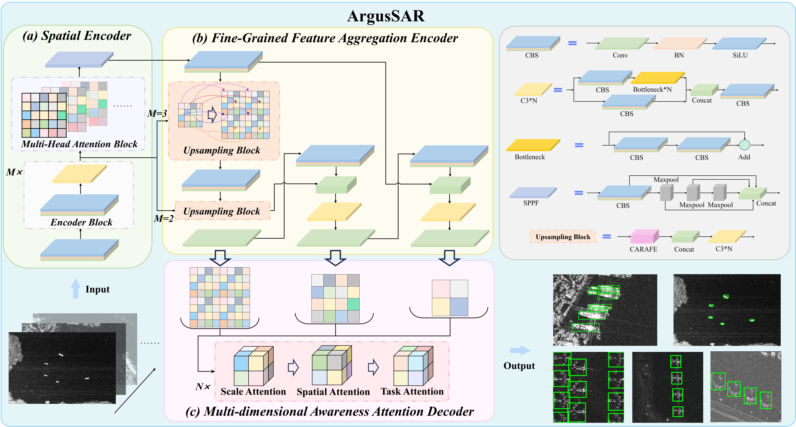

# ArgusSAR
This repo holds code for [ArgusSAR: A Multi-dimensional Perception and Robust Detection Method for Multi-scale Objects in SAR Images].The source code will be made public soon. Please wait.

# The overall architecture
The ArgusSAR framework is composed of Spatial Encoder, Fine-grained Feature Aggregation Encoder, and Multi-dimensional Awareness Attention Decoder.


# Citation
If you find this work useful, please consider citing:

```bibtex
@ARTICLE{11408003,
  author={Zhao, Jinqi and Sun, Weining and Chen, Zhisheng and Hu, Qiang and Li, Yuxuan and Shi, Hongtao and Niu, Yufen and Lu, Zhong},
  journal={IEEE Transactions on Geoscience and Remote Sensing}, 
  title={ArgusSAR: A Multidimensional Perception and Robust Detection Method for Multiscale Objects in SAR Images}, 
  year={2026},
  volume={64},
  number={},
  pages={1-17},
  keywords={Feature extraction;Detectors;Aircraft;Radar polarimetry;Marine vehicles;Synthetic aperture radar;Object detection;Accuracy;Scattering;Radar imaging;Deep learning;multiscale;multitask;object detection;synthetic aperture radar (SAR)},
  doi={10.1109/TGRS.2026.3665807}}
